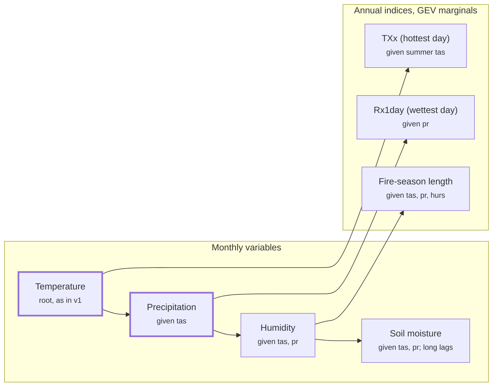

# METEOR v2: a multivariate noise model — scoping

*Scoping document, 2026-10-02. Code references are to `base` at `2edad23`.*

## Summary

METEOR v2 should replace independent per-variable noise with a **conditional
chain**: variables are generated in a fixed order, each conditioned on those
before it. This is what lets METEOR represent compound extremes (hot and dry
together), and add variables beyond temperature and precipitation without
refitting the ones already trained.

Today each variable's internal variability is fitted and drawn independently,
so a hot-and-dry summer comes out about as often as the two separate chances
multiplied together. Real climate, and CMIP6, has hot summers that tend to be
dry over land, so METEOR under-counts exactly the events that matter most for
crops and fire.

The chain keeps v1's speed (generation stays linear in the number of
variables), keeps each variable's fit separate, and reduces exactly to v1 when
every coupling is zero. Temperature and precipitation are the first case; an
annual heat extreme (hottest day of the year, TXx) is the proposed third,
because it tests the design's hardest part: mixing monthly and annual time
steps.

## Motivation

The impact metrics people ask for mostly depend on more than one variable, or
on weather finer than a monthly mean.

| Metric | Needs | Possible in v1? |
| --- | --- | --- |
| Drought (SPI-3, -6, -12) | Monthly precipitation only | Yes: METEOR already fits a gamma distribution to precipitation, which is what SPI uses |
| Unusually hot, wet or dry seasons | Monthly temperature or precipitation | Yes, one variable at a time |
| Heating, cooling and growing degree days | Monthly temperature | Yes: `meteor.impacts` already has heating and cooling degree days |
| Hot-and-dry seasons, crop stress | Temperature and precipitation **together** | Wrong: their variability is uncorrelated, so joint events are too rare |
| Hottest day, wettest day (TXx, Rx1day) | Daily data | No |
| Fire weather | Daily temperature, humidity, wind, precipitation | No |
| Heat stress (WBGT) | Temperature and humidity | No |
| Soil-moisture drought | Soil moisture, with long memory | No |

The first three rows can be built downstream (e.g. in meteor-view) on v1.
Everything below them needs either coupled variability or new variables, which
is what v2 is for.

Compound hot-dry events are the most pressing case. Over mid-latitude land in
summer, hot months tend to be dry months, so the joint chance is well above the
product of the separate chances; Zscheischler & Seneviratne (2017) is the usual
reference for how much that dependence matters. METEOR v1 gives a ratio of
about 1 everywhere, by construction. The crop model (`cropmodel` branch) is
driven by exactly these growing-season heat-and-drought combinations.

## Current design (v1)

In v1, every variable is a separate model: its own forced pattern, its own
variability, its own random draws.

- **Forced response:** pattern scaling of each variable against global
  temperature from the simple climate model (`scm_forcer_engine.py`,
  `pattern_logic_lib.py`).
- **Variability:** one `MeteorNoiseGenerator` per variable
  (`noise_generator.py`). It fits 40 area-weighted EOFs to the variable's
  anomalies, then a VAR model (lag 2) on their principal components, trained on
  piControl cut to its first 150 years (`cmip6_meteor_data_getter.py:679`).
- **Non-Gaussian variables:** a per-month distribution transform (gamma for
  precipitation) from the transform registry (`variable_transforms.py`),
  applied around the noise model.
- **Generation:** `generate_ensemble_outputs` loops over variables, each with
  its own random draws (`meteor_interface.py:739`). Temperature and
  precipitation share the forced warming, but their variability is independent.
- **Artifacts:** one portable bundle per variable per model, which meteor-view
  loads and runs in the browser.

This design is fast, simple, and lets each variable be trained and shipped on
its own. v2 should keep all three properties.

## Requirements and constraints

1. **Speed.** Generation cost must stay about linear in the number of
   variables. Heavy computation belongs in training, never at runtime.
2. **Backward compatibility.** With every coupling set to zero, v2 must
   reproduce v1 exactly, so v1 golden fixtures still pass.
3. **Incremental variables.** Adding a variable must not refit the ones already
   trained. With ~40 models, some needing a 32 GB machine, each full retraining
   is a campaign.
4. **Estimable from the data.** piControl is cut to 150 years, so there are 150
   samples per calendar month. Any coupling must be estimable from that, or
   from more data drawn on deliberately.
5. **Lazy loading in the browser.** meteor-view should load only the variables a
   view needs, plus whatever they are conditioned on.
6. **Uneven availability.** Fewer CMIP6 models publish humidity, wind, soil
   moisture or daily output than temperature and precipitation. Each model must
   be able to carry its own set of variables.

## Kinds of variable

The variables worth adding differ in ways a single model has to accommodate.

| Kind | Examples | What the design must allow |
| --- | --- | --- |
| Unbounded or skewed monthly fields | tas, pr, psl, rsds | Already handled in v1: transform to Gaussian, EOFs, VAR model |
| Bounded fields | hurs (0–100%), soil-moisture fraction | Other marginal transforms (logit, beta), added through the transform registry |
| Long-memory fields | mrso (soil moisture) | Longer or seasonal lags; lag 2 in months misses interannual memory |
| Annual extremes | TXx, Rx1day, fire-season length | An annual time step, extreme-value (GEV) marginals, conditioned on the monthly state of that year |
| Derived indices | Fire Weather Index, WBGT | The index emulated directly, because the daily inputs needed to compute it are not available |

The forced side generalizes too. Some variables do not scale with global
temperature alone: surface solar radiation is aerosol-dominated, and CO₂'s
direct effect on plants changes soil moisture, humidity and runoff
independently of warming. Each variable should be able to scale with more than
one driver; how far the current forcing engine already supports this per
forcing agent is an open question.

## Options considered

Only the conditional chain meets all six requirements; the others either can't
be estimated at scale or force full retraining.

| Option | How it couples | Captures lagged effects | Adding a variable | Estimable at 6 variables × 40 modes | Verdict |
| --- | --- | --- | --- | --- | --- |
| Joint shock covariance | One covariance across all variables' shocks, per month | No | Refits the whole matrix | No: 240×240 per month from 150 samples is singular | Fine for tas–pr alone; doesn't scale |
| Joint VAR model | One VAR on all variables' components together | Yes | Refits everything | No: parameters grow with the square of total modes | Overfits |
| Shared EOFs | One EOF basis on all fields stacked | Yes | Refits the basis, changes every bundle | Weighting between variables is arbitrary | Too disruptive |
| Shared latent drivers | Every variable loads on a few common modes (ENSO-like) | Yes, through the drivers | Fits one new set of loadings | Yes | Physical, but hard to fit; fallback |
| **Conditional chain** | Each variable regressed on earlier ones, plus its own noise | Yes, through lagged terms | Fits only the new variable | Yes: one variable's parameters at a time | **Proposed** |

The chain's main cost is that the order sets the direction of influence (see
below).

## Proposed design: the conditional chain

Each variable keeps its v1 machinery (transform, EOFs, VAR model) and gains one
new term: a regression of its shocks on its parents' components.

**The model.** For variable *v* with principal components *u_v* and parents
*P(v)*, in calendar month *m*:

$$
u_{v,t} = \sum_{l=1}^{L_v} A_{v,l}\, u_{v,t-l}
\;+\; \sum_{p \in P(v)} \sum_{l=0}^{K} C_{v,p,l}(m)\, u_{p,t-l}
\;+\; \varepsilon_{v,t}
$$

The first term is v1's VAR model. The second is the coupling: same-month
(*l* = 0) and lagged effects of each parent. With *C* = 0 the model is exactly
v1.

**Ordering.** A proposed starting order:

1. Temperature (root, unchanged from v1)
2. Precipitation, given temperature
3. Humidity, given temperature and precipitation
4. Soil moisture, given temperature and precipitation, with longer own lags
5. Annual indices, given the monthly state of their year: TXx given
   temperature, Rx1day given precipitation, fire-season length given
   temperature, humidity and precipitation

Arrows show only the generation order; each box lists all the variables it is
conditioned on. Stage 1 (bold) is temperature and precipitation.

**Estimation.**

- **Seasonality:** *C* varies with the month through a few smooth harmonics,
  not 12 free matrices. The temperature–precipitation relationship flips sign
  between summer and winter, so a year-round *C* would partly cancel itself,
  but 12 independent fits would overfit.
- **Shrinkage:** ridge or similar on *C*, chosen by cross-validation on
  held-out years.
- **More data:** besides piControl, residuals from historical and scenario runs
  once the forced response is removed.

**Annual indices.** An annual variable is a regression on its parents' monthly
components in the relevant season (e.g. TXx on June–August temperature
components), plus its own residual. That residual gets an extreme-value (GEV)
marginal through the transform registry. This mixes time steps without changing
the monthly model.

**Forced response.** Unchanged in structure: each variable keeps its own
pattern scaling. Variables that need it can scale with more than one driver
(e.g. aerosol forcing for solar radiation).

**The trade-off.** The order sets the direction of influence. Conditioning soil
moisture on temperature and precipitation is natural, but means drying soil
can't feed back to sustain a heatwave. Temperature's own autocorrelation partly
stands in for that. If validation shows the gap matters, shared latent drivers
are the fallback.

**Cost.** Training adds one regression per variable. Generation adds one small
matrix multiply per parent per month: still linear in the number of variables.

## Validation

Each coupling is accepted only when the emulator reproduces the CMIP6 model's
own joint behaviour, on years held out from training.

- **Correlation maps:** the grid-box correlation between parent and child
  variables in each season, e.g. June–August temperature against
  precipitation, emulator against piControl and historical.
- **Joint exceedance ratio:** the chance of a compound event (e.g. hottest 10%
  for temperature and driest 10% for precipitation in the same season), divided
  by the product of the two separate chances. v1 gives about 1 everywhere; the
  target is the CMIP6 model's own map.
- **Persistence:** autocorrelation and multi-year drought frequency, especially
  for soil moisture and SPI-12.
- **Annual indices:** the distribution of TXx and Rx1day against the model's
  own daily-derived values, including their change with warming.
- **No regression:** with couplings off, v1 golden fixtures must pass
  unchanged.

## Implications for the artifact format and meteor-view

The chain maps cleanly onto per-variable bundles; the main change is generating
variables together from one random stream.

- **Bundles:** each variable's bundle gains a list of its parents and its
  coupling coefficients. A v1 bundle is a v2 bundle with no parents, so
  existing exports keep working.
- **Format version:** bundles move to `_v2`. Readers accept both, treating v1
  as uncoupled. `docs/emulator_artifact_schema.md` (on the export branch) would
  document the new fields.
- **Generation:** variables are generated in chain order, in one pass, from one
  seeded stream, in Python and in meteor-view's JS kernel alike. A client loads
  only the variables it shows plus their parents.
- **Annual variables:** a new bundle kind with an annual time step and GEV
  parameters.
- **Per-model variable lists:** the model manifest records which variables each
  model has, so clients can hide metrics a model can't support.
- **Testing:** golden fixtures are regenerated for coupled models; v1 fixtures
  still pass with couplings off.
- **New views in meteor-view:** compound-event probabilities ("chance of a
  hot-and-dry summer"), and how often today's 1-in-20 event happens at each
  warming level.

## Staging

v2 lands in four stages, each with a gate that must pass before the next
starts.

1. **The mechanism, with temperature and precipitation.** Build the chain with
   precipitation conditioned on temperature.
   - Gate: joint hot-dry exceedance ratios match CMIP6 for several models, and
     v1 fixtures pass with couplings off.
2. **A third variable: TXx.** Add the annual hottest day, conditioned on summer
   temperature. It tests mixed time steps and GEV marginals, and is the most
   useful single extreme.
   - Gate: TXx distributions and their change with warming match each model's
     daily-derived values.
3. **meteor-view support.** v2 bundles, chain-order generation in JS, and the
   first compound-event views.
   - Gate: browser output matches METEOR's golden fixtures for coupled models.
4. **Further variables, one at a time.** Humidity (heat stress), soil moisture
   (drought with memory), fire weather, and the crop model.
   - Gate per variable: its own validation, without refitting the earlier ones.

**Relation to the current training run.** v2 is weeks of work, so meteor-view's
remaining large-grid models are still being trained on v1, which completes its
land-masked release. All models are then retrained once on v2 before the
Zenodo deposit.

## Open questions and risks

- [ ] Is precipitation transformed to Gaussian **before** its EOFs, so that
      couplings work on the Gaussian scale and carry through the
      back-transform?
- [ ] Does v1 add residual noise beyond the 40 modes? If so, that residual
      needs coupling too, or local correlations will be too weak.
- [ ] Does the forcing engine already support patterns per forcing agent (CO₂,
      aerosol), or does that need adding for solar radiation and soil
      moisture?
- [ ] How does the crop model (`cropmodel` branch) consume temperature and
      precipitation, and what does it need from v2?
- [ ] Is the ordering right? In particular, should soil moisture come before
      temperature over land, to keep the drying–heat feedback?
- [ ] How many of the CMIP6 models publish each candidate variable, and daily
      `tasmax` and `pr` for TXx and Rx1day?
- [ ] Is 150 years of piControl enough once couplings are added, or should
      more years be used?

Risks:

- **The chain's ordering misses feedbacks.** Mitigation: validate persistence
  and compound frequencies; fall back to shared latent drivers where they
  fail.
- **Annual indices drift from monthly ones.** A TXx inconsistent with the same
  year's summer temperature would confuse users. Mitigation: conditioning on
  that year's components, and checking their joint distribution.
- **Retraining cost.** v2 means one more full run across ~40 models, the large
  ones on a 32 GB machine.

## References

- Zscheischler, J. & Seneviratne, S. I. (2017). Dependence of drivers affects
  risks associated with compound events. *Science Advances*, 3(6), e1700263.
  <https://doi.org/10.1126/sciadv.1700263>
