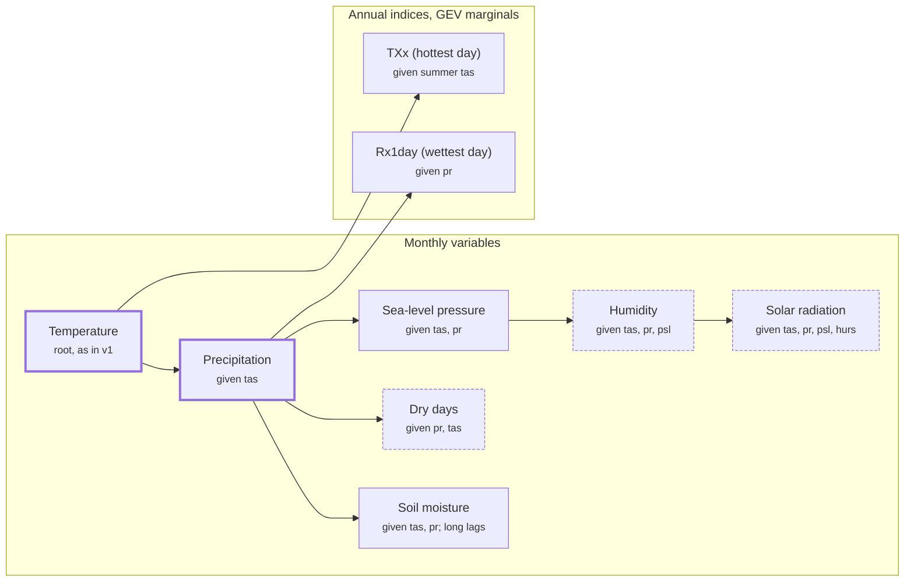

# METEOR v2: a multivariate noise model — scoping

*Scoping document, 2026-10-02; revised 2026-10-16 to take IAM-FIRE as a
consumer, 2026-11-18 to place v2 within a tiered design for downscaling
(see [Downscaling and generative tiers](#downscaling-and-generative-tiers)),
and again 2026-11-18 after stage 1's first tests (see
[Stage 1 findings](#stage-1-findings)).
Code references are to `base` at `2edad23`; IAM-FIRE references are
to [bc3LC/IAM-FIRE](https://github.com/bc3LC/IAM-FIRE) at `ad04771`.*

## Summary

METEOR v2 should replace independent per-variable noise with a **conditional
chain**: variables are generated in a fixed order, each conditioned on those
before it. This is what lets METEOR represent compound extremes (hot and dry
together), and add variables beyond temperature and precipitation without
refitting the ones already trained.

Today each variable's internal variability is fitted and drawn independently,
so a hot-and-dry summer comes out about as often as the two separate chances
multiplied together. Real climate, and CMIP6, has hot summers that tend to be
dry over land, so METEOR under-counts exactly the events that matter most for
crops and fire.

The chain keeps v1's speed (generation stays linear in the number of
variables), keeps each variable's fit separate, and reduces exactly to v1 when
every coupling is zero. Temperature and precipitation are the first case; an
annual heat extreme (hottest day of the year, TXx) is the proposed third,
because it tests the design's hardest part: mixing monthly and annual time
steps.

v2 also has a first named consumer: **IAM-FIRE**, the burned-area and
fire-emissions emulator of the Basque Centre for Climate Change (BC3). Its
climate predictors fix which variables v2 adds for fire (humidity, a monthly
dry-day count, surface solar radiation) and in what form. They also show that
v2 is not only a noise project. IAM-FIRE depends first on the **forced** change
in each month, which v1 does not cleanly separate, and only then on
variability. So v2 runs as two tracks: a forced-response track, which can start
on v1 and gives IAM-FIRE its mean projections, and the noise chain, which
gives it realistic year-to-year fire.

v2 is also the precursor to spatial and temporal downscaling, not something
downscaling would replace. Downscaling refines a large-scale state; it cannot
correct one, so a wrong coarse temperature–precipitation dependence carries
into every downscaled product. METEOR keeps its niche (as fast as possible,
and more informative than pattern scaling) by staying a fast core that runs in
the browser, with heavier generative tiers, such as a daily or
high-resolution mapper, built as optional modules on its output. That makes
the core's monthly output a public interface, adds sea-level pressure to the
chain as a conditioning variable, and offers a cheaper route to annual
extremes: distilling them from a daily mapper instead of fitting them per ESM.

Stage 1's first tests changed the design in two ways. The temperature–
precipitation link is local, so coupling the two variables' global EOFs, as
first proposed, recovers almost none of it; a **local coupling** in grid space
does. And v1 gives every calendar month the same noise variance, which makes
midlatitude summer temperature up to twice too variable; that is fixed first,
by **seasonal scaling**, because the local coupling inherits it. See
[Stage 1 findings](#stage-1-findings).

## Motivation

The impact metrics people ask for mostly depend on more than one variable, or
on weather finer than a monthly mean.

| Metric | Needs | Possible in v1? |
| --- | --- | --- |
| Drought (SPI-3, -6, -12) | Monthly precipitation only | Yes: METEOR already fits a gamma distribution to precipitation, which is what SPI uses |
| Unusually hot, wet or dry seasons | Monthly temperature or precipitation | Yes, one variable at a time |
| Heating, cooling and growing degree days | Monthly temperature | Yes: `meteor.impacts` already has heating and cooling degree days |
| Hot-and-dry seasons, crop stress | Temperature and precipitation **together** | Wrong: their variability is uncorrelated, so joint events are too rare |
| Hottest day, wettest day (TXx, Rx1day) | Daily data | No |
| Burned area and fire emissions (IAM-FIRE) | Monthly temperature, humidity, solar radiation and precipitation, and daily dry-day counts, together | No: see below |
| Heat stress (WBGT) | Temperature and humidity | No |
| Soil-moisture drought | Soil moisture, with long memory | No |

The first three rows can be built downstream (e.g. in meteor-view) on v1.
Everything below them needs either coupled variability or new variables, which
is what v2 is for.

Compound hot-dry events are the most pressing case. Over mid-latitude land in
summer, hot months tend to be dry months, so the joint chance is well above the
product of the separate chances; Zscheischler & Seneviratne (2017) is the usual
reference for how much that dependence matters. METEOR v1 gives a ratio of
about 1 everywhere, by construction. The crop model (`cropmodel` branch) is
driven by exactly these growing-season heat-and-drought combinations.

## A consumer: IAM-FIRE

IAM-FIRE (repository above; inputs at
[doi:10.5281/zenodo.20312037](https://doi.org/10.5281/zenodo.20312037))
projects burned area and fire carbon emissions for IAM scenarios. Today it
gets its climate from a chain of heavy tools: STITCHES (Tebaldi et al. 2022)
recombines one ESM's archived daily output to follow a scenario's global
temperature, then BASD (ISIMIP3BASD, Lange 2019) bias-adjusts and downscales it
to W5E5 at 0.5°, daily. It has been run for two ESMs, CanESM5 and
MPI-ESM1-2-LR, both among METEOR's models. METEOR would replace that chain,
for any of its models, in minutes rather than HPC campaigns.

**What the fire model needs.** Burned area comes from a binomial GLM with a
logit link and 14 coefficients (`code/python/IF_glm_model.py`), fitted to the
**time-mean** of observed predictors over 2002–2019 at 0.5°, and then applied
year by year. Its climate predictors:

| Predictor | How IAM-FIRE computes it | Inputs |
| --- | --- | --- |
| VPD (log) | Annual maximum of monthly vapour-pressure deficit | Monthly `tas`, `hurs` |
| Dry days (log) | Annual maximum of the monthly count of days with ≤ 1 mm | Daily `pr` |
| Dry-day seasonality (log, and its square) | (max − min) / mean of that year's 12 monthly counts | Daily `pr` |
| Precipitation (log) | Mean monthly total | Monthly `pr` |
| GPP (log) | P-model (pyrealm; Stocker et al. 2020), monthly, with fAPAR held at its climatology | Monthly `tas`, VPD, `rsds`, CO₂ |

The rest of the GLM is land use (grassland, cropland), the human development
index, grazing pressure and terrain, which come from the IAM and static
layers, not from METEOR. Fire emissions are burned area times fuel
consumption, which IAM-FIRE scales with annual-mean VPD, so they need nothing
new. Wind is computed but is not in the fitted model.

**What that means for v2.** Five requirements follow, each picked up below.

1. **Forced change month by month.** The annual maximum of monthly VPD and
   the seasonality of dry days depend on how each month changes, not the
   annual mean. This is the largest gap, and it is in the forced response, not
   the noise (see *Forced response* below).
2. **Humidity, coupled to temperature.** VPD is a nonlinear function of
   temperature and humidity together, so humidity has to come with its
   covariance with temperature. That is exactly what the chain provides; with
   it, VPD is computed from generated `tas` and `hurs` rather than emulated
   as its own field, and humidity is reused for heat stress.
3. **A monthly derived index.** The dry-day count needs daily precipitation
   that METEOR will not generate. It is emulated directly, as a monthly
   variable conditioned on the same month's precipitation: without that
   coupling a wet month could come out full of dry days.
4. **Several drivers for humidity and radiation.** VPD is IAM-FIRE's main
   climate driver, and land humidity falls partly because CO₂ closes plant
   stomata, not only because of warming; surface solar radiation is
   aerosol-dominated.
5. **Changes, not levels.** The GLM uses logs of absolute values, fitted on
   observations. The consistent input is the observed predictor plus METEOR's
   change in that predictor (see *Implications* below).

## Current design (v1)

In v1, every variable is a separate model: its own forced pattern, its own
variability, its own random draws.

- **Forced response:** pattern scaling of each variable against global
  temperature from the simple climate model (`scm_forcer_engine.py`,
  `pattern_logic_lib.py`), annual. `to_monthly` (`meteor.py:599`) repeats each
  year's value across its 12 months.
- **Seasonal cycle:** fitted inside the noise model, per grid cell, as annual
  and semiannual harmonics, each also multiplied by global temperature
  (`noise_generator.py:143`). So the noise model carries the *forced change* in
  the seasonal cycle, scaled linearly with global warming: `noise_only=True`
  keeps those temperature-modulated harmonics and removes only the intercept
  and the direct temperature term.
- **Variability:** one `MeteorNoiseGenerator` per variable
  (`noise_generator.py`). It fits 40 area-weighted EOFs to the variable's
  anomalies, then a VAR model (lag 2) on their principal components (with no
  exogenous term by default). It is trained on historical plus
  the training scenario (`ssp245` by default), against the pattern model's
  own warming for that scenario (`meteor_interface.py:500`); piControl, cut to
  its first 150 years (`cmip6_meteor_data_getter.py:679`), serves as the
  baseline for anomalies.
- **One variance all year:** the VAR's innovation covariance does not depend
  on the month, so every calendar month gets the year-round variance. Against
  held-out MPI-ESM1-2-LR members, regional summer temperature variability in
  the northern midlatitudes is 1.3–2× too large and winter variability too
  small. `seasonal_scaling` fixes this
  ([PR 113](https://github.com/benmsanderson/METEOR/pull/113); off by default).
- **No noise beyond the modes:** the 40 EOFs are all there is. For
  precipitation they explain about half the anomaly variance.
- **Non-Gaussian variables:** a per-month distribution transform (gamma for
  precipitation) from the transform registry (`variable_transforms.py`),
  applied to the generated output, per aggregation, against the ESM's own
  data. The EOFs are fitted to untransformed precipitation. Entries for
  `hurs` and `sfcWind` are
  sketched there but commented out.
- **Generation:** `generate_ensemble_outputs` loops over variables, each with
  its own random draws (`meteor_interface.py:739`). Temperature and
  precipitation share the forced warming, but their variability is independent.
- **Artifacts:** one portable bundle per variable per model, which meteor-view
  loads and runs in the browser.

This design is fast, simple, and lets each variable be trained and shipped on
its own. v2 should keep all three properties.

## Requirements and constraints

1. **Speed.** Generation cost must stay about linear in the number of
   variables. Heavy computation belongs in training, never at runtime.
2. **Backward compatibility.** With every coupling set to zero, v2 must
   reproduce v1 exactly, so v1 golden fixtures still pass.
3. **Incremental variables.** Adding a variable must not refit the ones already
   trained. With ~40 models, some needing a 32 GB machine, each full retraining
   is a campaign.
4. **Estimable from the data.** The noise model sees about 250 years of
   historical and scenario data per ensemble member (1850–2100), so about
   250 samples per calendar month. Any coupling must be
   estimable from that, or from more data drawn on deliberately.
5. **Lazy loading in the browser.** meteor-view should load only the variables a
   view needs, plus whatever they are conditioned on.
6. **Uneven availability.** Fewer CMIP6 models publish humidity, wind, soil
   moisture or daily output than temperature and precipitation. Each model must
   be able to carry its own set of variables.
7. **Separable forced seasonality.** A consumer must be able to get the forced
   change in each calendar month, without variability, as cheaply as the
   annual forced response. IAM-FIRE's mean projections need nothing else.

## Kinds of variable

The variables worth adding differ in ways a single model has to accommodate.

| Kind | Examples | What the design must allow |
| --- | --- | --- |
| Unbounded or skewed monthly fields | tas, pr, psl, rsds | Already handled in v1: transform to Gaussian, EOFs, VAR model |
| Bounded fields | hurs (0–100%), soil-moisture fraction | Other marginal transforms (logit, beta), added through the transform registry |
| Monthly counts from daily data | Dry days (≤ 1 mm), wet days, frost days | A bounded count, 0 to the days in the month (a binomial-type or logit transform), trained on indices computed from each ESM's daily output, and conditioned on the monthly variable it derives from |
| Long-memory fields | mrso (soil moisture) | Longer or seasonal lags; lag 2 in months misses interannual memory |
| Annual extremes | TXx, Rx1day | An annual time step, extreme-value (GEV) marginals, conditioned on the monthly state of that year |
| Derived indices | Fire Weather Index, WBGT | The index emulated directly, because the daily inputs needed to compute it are not available |
| Circulation, for conditioning | psl (sea-level pressure), or a few of its EOFs | Carried for what it tells later variables and downstream tiers, not for display: a warm, dry month can come from a blocking high or from scattered convection, and only circulation tells them apart |

Statistics *across* a year's months, such as IAM-FIRE's annual-maximum VPD,
annual-maximum dry-day count and dry-day seasonality, are not variables:
they are computed from the 12 generated months, so they inherit the monthly
fields' coupling and need no marginal of their own.

The forced side generalizes too. Some variables do not scale with global
temperature alone: surface solar radiation is aerosol-dominated, and CO₂'s
direct effect on plants changes soil moisture, humidity and runoff
independently of warming. Each variable should be able to scale with more than
one driver; how far the current forcing engine already supports this per
forcing agent is an open question.

## Options considered

Only the conditional chain meets all six requirements on variability; the
others either can't be estimated at scale or force full retraining. (The
seventh, forced seasonality, is independent of this choice.)

| Option | How it couples | Captures lagged effects | Adding a variable | Estimable at 6 variables × 40 modes | Verdict |
| --- | --- | --- | --- | --- | --- |
| Joint shock covariance | One covariance across all variables' shocks, per month | No | Refits the whole matrix | No: 240×240 per month from a few hundred samples is ill-conditioned | Fine for tas–pr alone; doesn't scale |
| Joint VAR model | One VAR on all variables' components together | Yes | Refits everything | No: parameters grow with the square of total modes | Overfits |
| Shared EOFs | One EOF basis on all fields stacked | Yes | Refits the basis, changes every bundle | Weighting between variables is arbitrary | Too disruptive |
| Shared latent drivers | Every variable loads on a few common modes (ENSO-like) | Yes, through the drivers | Fits one new set of loadings | Yes | Physical, but hard to fit; fallback |
| **Conditional chain** | Each variable regressed on earlier ones, plus its own noise | Yes, through lagged terms | Fits only the new variable | Yes: one variable's parameters at a time | **Proposed** |

The chain's main cost is that the order sets the direction of influence (see
below).

## Proposed design: the conditional chain

Each variable keeps its v1 machinery (transform, EOFs, VAR model) and gains one
new term: a regression of its shocks on its parents' components.

**The model.** For variable *v* with principal components *u_v* and parents
*P(v)*, in calendar month *m*:

$$
u_{v,t} = \sum_{l=1}^{L_v} A_{v,l}\, u_{v,t-l}
\;+\; \sum_{p \in P(v)} \sum_{l=0}^{K} C_{v,p,l}(m)\, u_{p,t-l}
\;+\; \varepsilon_{v,t}
$$

The first term is v1's VAR model. The second is the coupling: same-month
(*l* = 0) and lagged effects of each parent. With *C* = 0 the model is exactly
v1.

**Two kinds of coupling.** The form above couples components: it can only
carry dependence that lives in the parent's and child's leading EOFs. That
suits links set by large-scale circulation, such as conditioning on sea-level
pressure. Stage 1 showed it does not suit links set locally, by clouds and
soil moisture, as the temperature–precipitation link is: most of that
dependence is in the variance the EOFs discard. Those links use a **local
coupling**, in grid space, instead:

$$
y'(x,t) = \beta(x,m)\, s'(x,t) + e(x,t)
$$

where *s'* is the parent's anomaly at the same gridcell, *β* varies with
calendar month *m* through two harmonics, and the residual *e* gets the
variable's v1 machinery (EOFs and VAR model) in place of *y'* itself. Three
further pieces make it work:

- **Seasonal scaling** of both variables: anomalies are divided by each
  cell's spread for that calendar month before their EOFs, and multiplied
  back after generation. Without it the parent's summer variance is
  inflated, and *β·s'* with it.
- **A residual beyond the modes** at each output location: the unresolved
  parts of *s'*, *β·s'* and *e*, drawn jointly from their covariance for that
  calendar month. Without it the child is missing the variance its modes
  drop, the coupled part dominates, and the dependence comes out too strong
  (in the prototype, WNA 3.28 and CNA 3.41 against the ESM's 3.09 and 2.68).
- **Conditioning on parent components only.** The parent is generated first
  and passed down as components, so the child needs no gridded parent field.

It keeps the chain's properties. *β* is fitted per gridcell by least squares
on about 3,000 months, so it is well determined without shrinkage, and each
variable's fit stays separate. With *β* = 0, no residual and no scaling it is
exactly v1. And a location mean still collapses to a few numbers: for a
location with weights *w*, the local term is the parent's components times
one vector per calendar month,
*Σ_x w(x) β(x,m) σ_s(x,m) EOF_s(x)*, so the browser cost is the same order as
v1's.

Global component coupling, applied on top of the local term to *e*, added
nothing in stage 1, so temperature–precipitation uses the local form alone.
Which later links are local and which large-scale is decided per variable
by the same gate.

**Ordering.** A proposed starting order:

1. Temperature (root, unchanged from v1)
2. Precipitation, given temperature
3. Sea-level pressure, given temperature and precipitation
4. Dry-day count, given precipitation and temperature
5. Humidity, given temperature, precipitation and sea-level pressure
6. Surface solar radiation, given temperature, precipitation, sea-level
   pressure and humidity (cloud links them)
7. Soil moisture, given temperature and precipitation, with longer own lags
8. Annual indices, given the monthly state of their year: TXx given
   temperature, Rx1day given precipitation

Sea-level pressure comes after precipitation so that stage 1 (temperature and
precipitation alone) is unchanged. Physically, circulation drives both, so
moving it ahead of precipitation is an option once stage 1 has passed; it
would change precipitation's parents and so need precipitation refitted.

Items 4–6 are IAM-FIRE's. The earlier draft's annual fire-season length,
given temperature, humidity and precipitation, is dropped: IAM-FIRE's
predictors cover fire with monthly variables, and a fire-season index can
be computed from them if it is wanted.

```mermaid
flowchart LR
  subgraph monthly [Monthly variables]
    direction LR
    tas["Temperature<br/><small>root, as in v1</small>"]
    pr["Precipitation<br/><small>given tas</small>"]
    psl["Sea-level pressure<br/><small>given tas, pr</small>"]
    ndd["Dry days<br/><small>given pr, tas</small>"]
    hurs["Humidity<br/><small>given tas, pr, psl</small>"]
    rsds["Solar radiation<br/><small>given tas, pr, psl, hurs</small>"]
    mrso["Soil moisture<br/><small>given tas, pr; long lags</small>"]
    tas --> pr --> ndd
    pr --> psl --> hurs --> rsds
    pr --> mrso
  end
  subgraph annual [Annual indices, GEV marginals]
    direction LR
    txx["TXx (hottest day)<br/><small>given summer tas</small>"]
    rx1["Rx1day (wettest day)<br/><small>given pr</small>"]
  end
  tas --> txx
  pr --> rx1
  classDef stage1 stroke-width:3px
  class tas,pr stage1
  classDef fire stroke-dasharray:4 2
  class ndd,hurs,rsds fire
```

Arrows show only the generation order; each box lists all the variables it is
conditioned on. Stage 1 (bold) is temperature and precipitation; dashed boxes
are the variables IAM-FIRE needs. Sea-level pressure is not shown in any
browser view; it is there to condition later variables and downstream tiers.

**Estimation** (component coupling; the local form is above).

- **Seasonality:** *C* varies with the month through a few smooth harmonics,
  not 12 free matrices. The temperature–precipitation relationship flips sign
  between summer and winter, so a year-round *C* would partly cancel itself,
  but 12 independent fits would overfit.
- **Shrinkage:** ridge or similar on *C*, chosen by cross-validation on
  held-out years.
- **More data:** additional ensemble members, and piControl years beyond
  those used as the baseline.

**Annual indices.** An annual variable is a regression on its parents' monthly
components in the relevant season (e.g. TXx on June–August temperature
components), plus its own residual. That residual gets an extreme-value (GEV)
marginal through the transform registry. This mixes time steps without changing
the monthly model.

The regression and GEV parameters can come from two sources. The first is
each ESM's own daily output, as originally planned; but many of METEOR's
models do not publish daily `tasmax` or `pr`. The second is **distillation**
from a universal daily mapper (see
[Downscaling and generative tiers](#downscaling-and-generative-tiers)): run
the mapper offline on many core realizations, compute the index from its daily
fields, and fit the same regression to that. The browser bundle is the same
either way. Distillation covers every model at once; per-ESM fitting keeps
each model's own daily behaviour, and is where the per-model descriptors the
mapper needs come from.

**Forced response.** Each variable keeps its own pattern scaling, extended in
two ways that IAM-FIRE needs.

- **Forced seasonality, made explicit.** In v1 the forced change in the
  seasonal cycle lives inside the noise model's harmonics (see *Current
  design*). That works, but a consumer that wants only the forced monthly
  change has to load and run a noise bundle with the noise switched off, and
  v2's couplings act on the stochastic components, not on those harmonics.
  v2 should decide where forced seasonality lives: either kept in the noise
  bundle but documented and exported as a forced component of its own, or
  moved into the pattern model as monthly or harmonic patterns, which would
  also let it scale with more than global temperature. Either way, IAM-FIRE's
  mean projections need only this component plus the annual pattern.
- **Several drivers.** Variables that need it scale with more than one
  driver: aerosol forcing for solar radiation; CO₂ concentration, as well as
  warming, for humidity and soil moisture over land.

**The trade-off.** The order sets the direction of influence. Conditioning soil
moisture on temperature and precipitation is natural, but means drying soil
can't feed back to sustain a heatwave. Temperature's own autocorrelation partly
stands in for that. If validation shows the gap matters, shared latent drivers
are the fallback.

**Cost.** Training adds one regression per variable (per gridcell for a local
coupling). Generation adds one small matrix multiply per parent per month,
plus a few residual draws per location: still linear in the number of
variables.

## Validation

Each coupling is accepted only when the emulator reproduces the CMIP6 model's
own joint behaviour, on years held out from training.

- **Correlation maps:** the grid-box correlation between parent and child
  variables in each season, e.g. June–August temperature against
  precipitation, emulator against piControl and historical.
- **Joint exceedance ratio:** the chance of a compound event (e.g. hottest 10%
  for temperature and driest 10% for precipitation in the same season), divided
  by the product of the two separate chances. v1 gives about 1 everywhere; the
  target is the CMIP6 model's own map.
- **Persistence:** autocorrelation and multi-year drought frequency, especially
  for soil moisture and SPI-12.
- **Annual indices:** the distribution of TXx and Rx1day against the model's
  own daily-derived values, including their change with warming.
- **Forced seasonality:** the change in each calendar month's mean, against
  the ESM's own scenario runs, for each variable IAM-FIRE uses.
- **Burned area, end to end:** IAM-FIRE's GLM run on predictors from three
  sources, on held-out years: the ESM's own output, METEOR v1 (independent
  noise) and METEOR v2 (coupled). Because the GLM is nonlinear (logit link,
  logged predictors), the gap between v1 and v2 is a single impact-relevant
  measure of what coupling buys. For CanESM5 and MPI-ESM1-2-LR, IAM-FIRE's
  own STITCHES and BASD run gives a fourth comparison.
- **No regression:** with couplings off, v1 golden fixtures must pass
  unchanged.

Because the joint exceedance ratio uses quantiles, it is unchanged by the
precipitation transform (a monotone map per month and location), so it can be
checked on noise-only regional series without the full pipeline.

### Stage 1 findings

Tested on MPI-ESM1-2-LR: trained on member r1i1p1f1 (historical and ssp245,
1850–2100), compared with nine held-out members over 1980–2040, 100
realizations, forced change removed by subtracting the ensemble mean. The
ratio is for the hottest fifth and driest fifth of summer seasons together.

| Region | ESM (90% interval) | v1 | Component coupling | Local coupling |
| --- | --- | --- | --- | --- |
| WNA JJA | 3.09 (2.66–3.36) | 0.97 | 0.97 | 2.84 |
| CNA JJA | 2.68 (2.29–3.03) | 0.98 | 1.20 | 3.04 |
| ENA JJA | 1.18 (0.86–1.51) | 1.00 | 1.10 | 1.52 |
| WCE JJA | 2.45 (2.09–2.79) | 1.03 | 1.16 | 2.45 |
| MED JJA | 2.09 (1.74–2.50) | 1.11 | 1.07 | 2.03 |
| EEU JJA | 2.54 (2.13–2.82) | 0.97 | 1.14 | 2.52 |
| EAS JJA | 1.04 (0.78–1.39) | 1.05 | 0.88 | 1.43 |
| SAU DJF | 1.20 (0.93–1.51) | 1.05 | 1.05 | 1.52 |
| SES DJF | 1.11 (0.88–1.56) | 1.07 | 1.19 | 1.83 |
| WSAF DJF | 1.94 (1.59–2.20) | 1.00 | 1.57 | 2.07 |
| ESAF DJF | 2.31 (1.99–2.64) | 0.91 | 1.73 | 2.25 |

Component coupling is the design above with 40 modes, fitted in the full
pipeline; 120 modes did no better. Local coupling is a prototype (noise-only,
regional, 40 modes, with seasonal scaling and the residual), not yet in the
package.

- **Component coupling fails.** It explains 8% of precipitation's innovation
  variance out of sample. Even before any coupling, METEOR's 40-mode
  reconstruction of its own training member gives a summer WNA correlation of
  −0.28, against the ESM's −0.67: the dependence is outside the modes.
- **Local coupling nearly passes.** It falls inside the ESM's 90% interval in
  6–9 of 11 regions, depending on the seed and on 20, 40 or 80 modes; several
  misses are over by 0.01. Correlations match too (WNA −0.72 against −0.67).
- **It over-couples where the ESM's dependence is weak** (SES in every run;
  EAS and SAU in some). One possible cause, not yet tested: forced change left
  in the training member's anomalies would add a spurious hot-dry link.
- **Seasonal scaling is a prerequisite**, and fixes temperature on its own: in
  the full pipeline the share of region-seasons whose seasonal-mean
  temperature spread is within 0.8–1.25× of the ESM rises from 61% to 93%.
  Precipitation does not benefit (98% falls to 59%, its seasonal means about
  10% too variable): its quantile map already corrects the monthly
  distribution. So scaling suits temperature; for precipitation's residual
  under a local coupling it still has to be checked.

## Downscaling and generative tiers

METEOR works on each ESM's grid (roughly 1–2°) at a monthly step. Users will
ask for finer grids and daily weather. Machine-learning downscaling cannot run
in the browser, and METEOR's niche is to be as fast as possible while being
more informative than pattern scaling. So downscaling is built as optional
tiers on top of the core, never inside it.

| Tier | Runs | Gives | Where it comes from |
| --- | --- | --- | --- |
| **Core** | Browser, milliseconds | Monthly coupled variability, forced seasonality, several drivers, on the ESM grid | v1, then this document |
| **Distilled indices** | Browser, nearly free | Daily-derived indices (TXx, Rx1day, dry days, VPD extremes) as regressions on the monthly state | Fitted offline from the generative tier, or from ESM daily output (see *Annual indices*) |
| **Light spatial** | Browser or server, cheap | Change factors on an observed climatology, or a linear map from the core's EOFs to fine-scale fields | Observations or reanalysis |
| **Generative** | GPU, offline | Daily, high-resolution, multivariate fields | A universal daily mapper, and later generative spatial downscaling |

**The core's output is the interface.** Every tier consumes the same thing:
one realization's monthly fields on the ESM grid, its forced component
separately, global temperature and forcing from CICERO-SCM, and the model,
scenario and seed. Two rules follow.

- **The core is the truth at monthly scale.** Daily or fine-scale output must
  aggregate back to the core's monthly fields on the ESM grid, by rescaling
  after generation or by constraining the sampler. Otherwise meteor-view and a
  downstream tier would disagree about the same realization.
- **The core must carry enough to condition on.** Monthly temperature and
  precipitation underdetermine daily weather. This is why sea-level pressure
  joins the chain, though no browser view needs it.

**A universal daily mapper.** One model across all ESMs, not one per ESM. It
takes a month's multivariate anomaly, mean state, warming level, location and
season, and returns daily fields consistent with them. It gives up each ESM's
own daily behaviour; spread between models still enters through the monthly
state. Where models differ materially at the daily scale, such as how
precipitation intensity scales with warming, a few per-model descriptors
become extra inputs. Candidate methods:

| Method | Strength | Weakness |
| --- | --- | --- |
| Statistical weather generator (e.g. GWGEN; Sommer & Kaplan 2017) | Cheap, open source, global | Mostly one site and one variable at a time: weak spatial and cross-variable coherence |
| Analog resampling ("method of fragments") from ERA5 or W5E5 | Resamples whole observed days, so keeps spatial, temporal and cross-variable consistency; indices come straight from the daily fields | Cannot go beyond the observed record; changes in the shape of the daily distribution must be added separately |
| Conditional diffusion, monthly to daily (e.g. DiffESM; Bassetti et al. 2024) | Learns daily variability, including its change with warming | Needs a GPU, and daily training data |

Training data is the larger choice:

| Training data | Strength | Weakness |
| --- | --- | --- |
| Reanalysis only (ERA5, W5E5) | Real weather | About 85 years and little warming, so changes in daily extremes are extrapolated |
| CMIP6 daily output, pooled across models | Spans the warming range; learns how the daily distribution shifts | Inherits ESM biases at the daily scale |
| Pretrain on pooled CMIP6, anchor to reanalysis | Both | More work; must check that the anchoring keeps the learned response to warming |

AI weather and climate models (ACE2, Watt-Meyer et al. 2025; NeuralGCM;
GenCast) are another route: METEOR would supply boundary conditions, such as
sea-surface temperature patterns, and the model the weather. That gives
dynamically consistent daily weather, but loses the link to each ESM's own
behaviour, which is much of METEOR's identity. They are more useful as a
reference for checking a mapper's daily statistics.

**Spatial downscaling.** Options, cheapest first:

- **Change factors** onto an observed climatology (W5E5 at 0.5°, CHELSA at
  1 km, ERA5-Land at 9 km). Already the plan for `meteor.impacts.fire`, and
  the baseline every other option has to beat.
- **Quantile (delta) mapping** (Cannon et al. 2015; ISIMIP3BASD, Lange 2019;
  open-source implementations in xclim and ibicus). Applied one variable at a
  time it weakens dependence between variables, which undoes v2's coupling;
  multivariate methods such as MBCn (Cannon 2018) avoid that.
- **A linear map from the core's EOFs to fine-scale fields**, regressed on
  coarsened observations, plus a stochastic fine-scale residual. It ships as a
  matrix and runs in the browser. It is linear and assumes the coarse-to-fine
  relationship does not change with warming.
- **Generative downscaling** (diffusion, e.g. CorrDiff; Mardani et al. 2025).
  Super-resolution has many valid answers, so calibrated fine-scale
  variability needs a generative model. Trained on observations, it assumes
  the coarse-to-fine relationship holds as climate changes, which is doubtful
  for snowlines, orographic rain and convection. Trained on coarse/fine model
  pairs, as regional-climate-model emulators are (Doury et al. 2023; CORDEX,
  convection-permitting and km-scale global runs), it learns how that
  relationship changes, but inherits the fine model's biases and coverage.
  Analog methods such as LOCA2 (Pierce et al. 2023) are a non-ML reference.

**Distillation.** The generative tier also trains the fast one. Running the
daily mapper offline on many core realizations and regressing the indices
people ask for on the monthly state gives coefficients that ship in browser
bundles. The browser then has daily-derived indices for the cost of a matrix
multiply, and anyone who needs the daily fields themselves runs the mapper.

**What would make v2 redundant.** Only an end-to-end generative emulator,
mapping global temperature and forcing directly to daily, high-resolution
fields. That would replace METEOR as a whole, giving up its speed,
transparency and browser delivery: a different product, not a successor.

## Implications for the artifact format and meteor-view

The chain maps cleanly onto per-variable bundles; the main change is generating
variables together from one random stream.

- **Bundles:** each variable's bundle gains a list of its parents and its
  coupling coefficients. A v1 bundle is a v2 bundle with no parents, so
  existing exports keep working. For a local coupling, each location carries
  one projection of the parent's components per calendar month, the child
  residual's projection per calendar month, and the residual covariance per
  calendar month; all are a few hundred numbers per location.
- **Format version:** seasonal scaling already takes artifact schema
  version 2 (per-month noise projections, `eof_projection_monthly`), and
  files without it stay version 1. Couplings will need the next version.
  Readers accept older versions, treating them as uncoupled.
  `docs/emulator_artifact_schema.md` documents the fields.
- **The residual is per location.** Drawn independently at each location, it
  carries no correlation between locations, so joint statistics across two
  regions rely on the modes alone. Gridded output needs a spatial model for it
  (see *Open questions*).
- **A public interface:** the schema is what downstream tiers, including
  third-party ones, read. It should document the core's realization output
  (monthly fields, forced component, global drivers, model, scenario, seed)
  as a stable contract, not only meteor-view's input.
- **Generation:** variables are generated in chain order, in one pass, from one
  seeded stream, in Python and in meteor-view's JS kernel alike. A client loads
  only the variables it shows plus their parents.
- **Forced seasonality:** however it is stored, a reader can produce the
  forced monthly change without generating noise.
- **Annual variables:** a new bundle kind with an annual time step and GEV
  parameters.
- **Per-model variable lists:** the model manifest records which variables each
  model has, so clients can hide metrics a model can't support.
- **Testing:** golden fixtures are regenerated for coupled models; v1 fixtures
  still pass with couplings off.
- **New views in meteor-view:** compound-event probabilities ("chance of a
  hot-and-dry summer"), and how often today's 1-in-20 event happens at each
  warming level.

**A fire impact module.** IAM-FIRE's scoring becomes `meteor.impacts.fire`, an
`ImpactCalculator` beside degree days and crops:

- **The GLM, frozen:** its 14 coefficients stored as data, not refitted on
  every run as IAM-FIRE does now. That is small enough for meteor-view.
- **Predictors by the delta method:** each predictor is computed from METEOR
  on the ESM grid, as a change from 2002–2019, regridded to 0.5° and added to
  the observed predictor that the GLM was fitted on. Bias in the ESM's own
  climate then drops out, which BASD otherwise handles, and the observed
  predictor already includes the effect of observed variability.
- **GPP:** the P-model (pyrealm, an optional dependency), monthly and per
  cell, with CO₂ from CICERO-SCM for the same scenario, so temperature and
  CO₂ come from one model run.
- **Fuel consumption:** IAM-FIRE's biome and fuel-load tables, scaled by VPD
  as it does.
- **Non-climate inputs:** land use, human development index, grazing pressure
  and terrain, from the scenario, not from METEOR (see *Open questions*).

## Staging

v2 lands in stages, each with a gate that must pass before the next starts.
Stage 0 is the forced-response track and can run alongside stage 1.

0. **Forced seasonality and IAM-FIRE's forced patterns, on v1.** Settle where
   the forced seasonal cycle lives (see *Forced response*), and fit forced
   patterns for humidity, solar radiation and the dry-day count, each with
   the drivers it needs. Requirement 3 already allows a variable to be added
   with a forced pattern and no noise. Then build `meteor.impacts.fire`
   with the delta method.
   - Gate: each forced monthly change matches the ESM's own scenario runs,
     and burned area from METEOR's forced response tracks burned area from
     the ESM's own output, decade by decade.
   - Delivers: mean burned-area and emission projections from IAM-FIRE for
     every METEOR model with these variables, for any emissions scenario.
1. **The mechanism, with temperature and precipitation.** Build the chain with
   precipitation conditioned on temperature.
   - Gate: joint hot-dry exceedance ratios match CMIP6 for several models, and
     v1 fixtures pass with couplings off.
   - Status (2026-11-18): component coupling built and failed the gate;
     local coupling prototyped and close to passing on one model (see
     [Stage 1 findings](#stage-1-findings)). Remaining, in order:
     1. Seasonal scaling: merge
        [PR 113](https://github.com/benmsanderson/METEOR/pull/113), and
        decide whether it becomes the default for temperature.
     2. Local coupling, with its residual, in the package and its bundles.
     3. Check precipitation's seasonal-mean spread under the coupled model.
     4. Test the over-coupling in SES (detrended training anomalies).
     5. Run the gate on at least four models with large ensembles, e.g.
        MPI-ESM1-2-LR, CanESM5, MIROC6 and ACCESS-ESM1-5.
2. **A third variable: TXx.** Add the annual hottest day, conditioned on summer
   temperature. It tests mixed time steps and GEV marginals, and is the most
   useful single extreme. One pass over each model's daily output extracts
   everything later stages need from it: TXx, Rx1day and the monthly dry-day
   count.
   - Gate: TXx distributions and their change with warming match each model's
     daily-derived values.
   - The coefficients come from per-ESM daily output here. Once a universal
     daily mapper exists (stage 5), distillation can supply them for models
     without daily output, with this stage's per-ESM fits as its check.
3. **meteor-view support.** v2 bundles, chain-order generation in JS, and the
   first compound-event views.
   - Gate: browser output matches METEOR's golden fixtures for coupled models.
4. **Fire weather for IAM-FIRE, then further variables, one at a time.**
   First sea-level pressure, then the dry-day count, humidity and solar
   radiation, in chain order, then IAM-FIRE run on coupled realizations. After that, soil moisture
   (drought with memory) and heat stress, which reuses humidity.
   - Gate per variable: its own validation, without refitting the earlier ones.
   - Gate for IAM-FIRE: the end-to-end burned-area comparison above.
5. **Downscaling tiers (research track, outside the core).** A universal
   daily mapper on the core's output, then distillation of daily-derived
   indices into browser bundles, and the light spatial tier. Generative
   spatial downscaling follows only if the light tier proves inadequate.
   None of this changes the core or its bundles beyond the distilled
   coefficients.
   - Gate for the mapper: its daily fields aggregate exactly to the core's
     monthly fields, and its daily statistics (TXx, Rx1day, dry-spell lengths,
     their change with warming) match held-out ESM daily output.
   - Gate for distillation: distilled indices match per-ESM fits from stage 2
     where those exist.
   - Gate for the light spatial tier: it matches or beats IAM-FIRE's
     ISIMIP3BASD output for CanESM5 and MPI-ESM1-2-LR on held-out years.

**Relation to the current training run.** v2 is weeks of work, so meteor-view's
remaining large-grid models are still being trained on v1, which completes its
land-masked release. All models are then retrained once on v2 before the
Zenodo deposit.

## Open questions and risks

- [x] Is precipitation transformed to Gaussian **before** its EOFs, so that
      couplings work on the Gaussian scale and carry through the
      back-transform? *No: the EOFs are fitted to untransformed
      precipitation, and the gamma map is applied to the generated output.
      Rank-based statistics such as the joint exceedance ratio are unchanged
      by it.*
- [x] Does v1 add residual noise beyond the 40 modes? If so, that residual
      needs coupling too, or local correlations will be too weak. *No, and
      the 40 modes miss about half of precipitation's variance. Hence the
      local coupling and its per-location residual.*
- [ ] Should seasonal scaling become the default for temperature? It changes
      every published output and forces cached noise models to retrain.
- [ ] Why does seasonal scaling make precipitation's seasonal means about 10%
      too variable, and should precipitation's residual be scaled under a
      local coupling?
- [ ] Does forced change left in the single training member's anomalies cause
      the over-coupling in SES, and would detrending, more members or
      piControl fix it?
- [ ] How should the residual beyond the modes be modelled for gridded output,
      where it needs spatial correlation?
- [ ] Which later links (precipitation to dry days, temperature to humidity,
      sea-level pressure to the rest) are local, and which large-scale?
- [ ] Does the forcing engine already support patterns per forcing agent (CO₂,
      aerosol), or does that need adding for solar radiation, humidity and
      soil moisture?
- [ ] How well do the noise model's temperature-modulated harmonics reproduce
      each ESM's change in the seasonal cycle, and should forced seasonality
      move into the pattern model?
- [ ] How does the crop model (`cropmodel` branch) consume temperature and
      precipitation, and what does it need from v2?
- [ ] Is the ordering right? In particular, should soil moisture come before
      temperature over land, to keep the drying–heat feedback?
- [ ] How many of the CMIP6 models publish each candidate variable: monthly
      `hurs` and `rsds`, and daily `tasmax` and `pr` for TXx, Rx1day and
      dry days? The models with all of IAM-FIRE's set are its ensemble.
- [ ] Are about 250 samples per calendar month enough once couplings are
      added, or should more members be used?
- [ ] Can the IAM-FIRE authors share the GLM's observed predictors and fitted
      coefficients under a licence METEOR can ship, and their STITCHES and BASD
      predictors for CanESM5 and MPI-ESM1-2-LR for validation?
- [ ] Land use for METEOR's scenarios: IAM-FIRE expects ESA CCI land-cover
      fractions downscaled from GCAM by Demeter. The SSP and CMIP7 scenarios
      would come from LUH2 or LUH3, whose classes need mapping onto ESA CCI's.
      The human development index is chosen by SSP, so the CMIP7 markers each
      need an SSP.
- [x] How many of METEOR's models publish daily `tas`, `tasmax`, `pr` and
      `psl`, and monthly `psl`? This sets both the mapper's pooled training
      set and which models need distilled rather than per-ESM indices.
      *Surveyed 2026-11-18 from catalog listings (Pangeo CMIP6 archive, and
      ESGF via the DKRZ and CEDA index nodes), for historical and ssp245.
      Not yet checked: that the four variables share an ensemble member, and
      that their time coverage is complete.*
      - Monthly `psl`: all 40 models on ESGF; Pangeo lacks only
        ACCESS-ESM1-5 under ssp245. No obstacle for the chain.
      - All four daily variables, complete in Pangeo (21): ACCESS-CM2,
        BCC-CSM2-MR, CMCC-ESM2, CNRM-CM6-1, CNRM-ESM2-1, CanESM5, EC-Earth3,
        EC-Earth3-Veg, GFDL-CM4, GFDL-ESM4, INM-CM4-8, INM-CM5-0,
        IPSL-CM6A-LR, KACE-1-0-G, MIROC6, MPI-ESM1-2-HR, MPI-ESM1-2-LR,
        MRI-ESM2-0, NorESM2-LM, NorESM2-MM, TaiESM1.
      - Complete only with ESGF (8): ACCESS-ESM1-5, CMCC-CM2-SR5, FGOALS-g3,
        HadGEM3-GC31-LL, KIOST-ESM, MIROC-ES2L, NESM3, UKESM1-0-LL.
      - Missing only daily `tasmax` (3): CESM2, CESM2-WACCM, IITM-ESM. They
        qualify if the mapper uses `tas` alone.
      - Partial (4): AWI-CM-1-1-MR (no historical `pr` or `psl`),
        CAMS-CSM1-0 (no daily `psl`), CNRM-CM6-1-HR (no ssp245 `tasmax` or
        `pr`), FGOALS-f3-L (no ssp245 daily output).
      - Little or no daily output (4): CAS-ESM2-0, GISS-E2-1-G, GISS-E2-1-H,
        MCM-UA-1-0.
      - piControl: 26 models have all four daily variables.

      So a pooled mapper has ample training data: the 21 Pangeo-complete
      models, several with 30 or more historical members. Of the 29 models
      in meteor-view's current release, 7 lack the daily set from any source
      (CAS-ESM2-0, CESM2, CESM2-WACCM, CNRM-CM6-1-HR, FGOALS-f3-L,
      GISS-E2-1-G, MCM-UA-1-0); those, and any ESGF-only model not fetched,
      would rely on distilled indices.
- [ ] What should the daily mapper train on: reanalysis, pooled CMIP6 daily
      output, or both? And which method: analog resampling first, or
      conditional diffusion?
- [ ] Which consumer sets the target spatial resolution: IAM-FIRE at 0.5°,
      or km-scale users? This decides whether the light spatial tier is
      enough.
- [ ] Should the mapper also condition on a few per-model descriptors, and
      which ones?

Risks:

- **One model so far.** The local coupling has been tested only on
  MPI-ESM1-2-LR. Mitigation: the multi-model gate before anything ships.
- **The chain's ordering misses feedbacks.** Mitigation: validate persistence
  and compound frequencies; fall back to shared latent drivers where they
  fail.
- **Annual indices drift from monthly ones.** A TXx inconsistent with the same
  year's summer temperature would confuse users. Mitigation: conditioning on
  that year's components, and checking their joint distribution.
- **Forced seasonality scaled with global temperature alone** mis-scales
  humidity and radiation where CO₂ and aerosols drive them, and so
  mis-scales fire. Mitigation: the multi-driver patterns of stage 0.
- **Retraining cost.** v2 means one more full run across ~40 models, the large
  ones on a 32 GB machine.
- **Downstream tiers pull the core off course.** Generative work is
  open-ended, and could tempt runtime cost or GPU dependence into the core.
  Mitigation: the core's output is a fixed interface; tiers only read it, and
  only distilled coefficients flow back.

## References

- Bassetti, S., Hutchinson, B., Tebaldi, C. & Kravitz, B. (2024). DiffESM:
  Conditional emulation of temperature and precipitation in Earth system
  models with 3D diffusion models. *Journal of Advances in Modeling Earth
  Systems*, 16, e2023MS004194. <https://doi.org/10.1029/2023MS004194>
- Cannon, A. J. (2018). Multivariate quantile mapping bias correction: an
  N-dimensional probability density function transform for climate model
  simulations of multiple variables. *Climate Dynamics*, 50, 31–49.
  <https://doi.org/10.1007/s00382-017-3580-6>
- Cannon, A. J., Sobie, S. R. & Murdock, T. Q. (2015). Bias correction of GCM
  precipitation by quantile mapping: how well do methods preserve changes in
  quantiles and extremes? *Journal of Climate*, 28, 6938–6959.
  <https://doi.org/10.1175/JCLI-D-14-00754.1>
- Doury, A., Somot, S., Gadat, S., Ribes, A. & Corre, L. (2023). Regional
  climate model emulator based on deep learning: concept and first evaluation
  of a novel hybrid downscaling approach. *Climate Dynamics*, 60, 1751–1779.
  <https://doi.org/10.1007/s00382-022-06343-9>
- Lange, S. (2019). Trend-preserving bias adjustment and statistical
  downscaling with ISIMIP3BASD (v1.0). *Geoscientific Model Development*, 12,
  3055–3070. <https://doi.org/10.5194/gmd-12-3055-2019>
- Mardani, M. et al. (2025). Residual corrective diffusion modeling for
  km-scale atmospheric downscaling. *Communications Earth & Environment*, 6,
  124. <https://doi.org/10.1038/s43247-025-02042-5>
- Pierce, D. W., Cayan, D. R., Feldman, D. R. & Risser, M. D. (2023). Future
  increases in North American extreme precipitation in CMIP6 downscaled with
  LOCA. *Journal of Hydrometeorology*, 24, 951–975.
  <https://doi.org/10.1175/JHM-D-22-0194.1>
- Sommer, P. S. & Kaplan, J. O. (2017). A globally calibrated scheme for
  generating daily meteorology from monthly statistics: Global-WGEN (GWGEN)
  v1.0. *Geoscientific Model Development*, 10, 3771–3791.
  <https://doi.org/10.5194/gmd-10-3771-2017>
- Stocker, B. D. et al. (2020). P-model v1.0: an optimality-based light use
  efficiency model for simulating ecosystem gross primary production.
  *Geoscientific Model Development*, 13, 1545–1581.
  <https://doi.org/10.5194/gmd-13-1545-2020>
- Tebaldi, C. et al. (2022). STITCHES: creating new scenarios of climate
  model output by stitching together pieces of existing simulations. *Earth
  System Dynamics*, 13, 1557–1609. <https://doi.org/10.5194/esd-13-1557-2022>
- Watt-Meyer, O. et al. (2025). ACE2: accurately learning subseasonal to
  decadal atmospheric variability and forced responses. *npj Climate and
  Atmospheric Science*, 8, 205. <https://doi.org/10.1038/s41612-025-01090-0>
- Zscheischler, J. & Seneviratne, S. I. (2017). Dependence of drivers affects
  risks associated with compound events. *Science Advances*, 3(6), e1700263.
  <https://doi.org/10.1126/sciadv.1700263>
